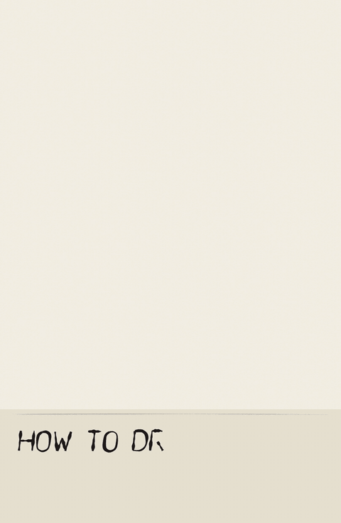

<p align="center">
  
</p>

<h1 align="center">anidoodle</h1>

<p align="center"><strong>De l'art dessiné à la main, écrit en code.</strong></p>

<p align="center">
  Illustrations, accélérés de dessin, films, vidéos explicatives et art web interactif dans 31 styles.<br>
  Chaque trait est une fonction et chaque note un calcul, si bien que la même source<br>
  redessine la même image sur toute machine, à toute taille, pour de bon.
</p>

<p align="center">
  <a href="https://github.com/alexgreensh/anidoodle/releases"></a>
  <a href="LICENSE"></a>
  
  
</p>

<p align="center"><a href="README.md">English</a> · <a href="README.ja-JP.md">日本語</a> · <a href="README.zh-CN.md">简体中文</a> · <a href="README.ko-KR.md">한국어</a> · <b>Français</b> · <a href="README.es-ES.md">Español</a></p>

<p align="center">
  <a href="#31-styles-au-choix">Styles</a> ·
  <a href="#chaque-style-se-dessine-sous-vos-yeux">Films de dessin</a> ·
  <a href="#de-la-musique-composée-en-code">Musique</a> ·
  <a href="#ce-que-vous-pouvez-créer">Ce que vous pouvez créer</a> ·
  <a href="#ce-quil-embarque">Ce qu'il embarque</a> ·
  <a href="#ça-dessine-puis-ça-bouge">Mouvement</a> ·
  <a href="#démarrer">Démarrer</a>
</p>

## 31 styles au choix

<p align="center">
  
</p>

Chaque style est une façon bien à lui de poser une trace : l'effilement d'une plume, le débordement d'un lavis, le grain de la craie sur l'ardoise, le bord déchiré du papier découpé, la trame d'un tambour de risographie, un seul trait gravé qui s'enroule pour devenir une lune. Le sujet change de forme selon la main qui le dessine, comme il le ferait pour trente et un illustrateurs différents. Chaque style s’accompagne aussi d’un film où son image se dessine trait après trait, dans l’ordre de travail d’un artiste qui emploie ce médium. Choisissez-en un pour votre marque, et toutes les images suivantes arriveront de la même main. Chaque planche ci-dessus, et la planche-contact elle-même, est dessinée par du code dans ce dépôt.

<details>
<summary><b>Les 31 styles</b> et leur façon de prendre forme</summary>

| Style | Comment il est réalisé |
|---|---|
| **Stylo bille** | Un seul stylo ; les hachures superposées font les valeurs |
| **Couleurs fragmentées** | Des touches de couleurs non mélangées, à la manière impressionniste |
| **Craie sur ardoise** | Le côté de la craie frotte et laisse sa poussière |
| **Fusain effacé** | Du fusain dessiné, effacé puis repris, avec ses fantômes |
| **Crayon de couleur** | Des hachures orientées sur un papier crème à grain |
| **Crayon de cire** | Des gribouillis cireux qui sautent les creux du papier |
| **Collage de papier découpé** | Du papier déchiré et découpé, sans traits dessinés |
| **Plan cyanotype** | Un dessin à la plume à tracer sur papier cyanotype |
| **Broderie** | Du fil piqué dans du lin tendu sur un tambour |
| **Vecteur à plat** | Des formes géométriques nettes, du grain et de longues ombres |
| **Conte populaire illustré** | Un premier plan peint qui se fond dans le crayon sur papier crème |
| **Encre et lavis** | Les lavis d'abord, puis une plume souple |
| **Isométrique** | Une coupe isométrique 2:1 aux facettes colorées à plat |
| **3D low poly** | Des triangles aux facettes colorées à plat, dessinés en code |
| **BD au marqueur** | Des aplats et un seul contour épais |
| **Gouache du milieu du siècle** | Des formes mates et opaques, des bords au pinceau sec, un trait libre |
| **Trame sur papier journal** | Une trame noire et une couleur d'accompagnement sur papier journal |
| **Peinture à l'huile** | Des coups de brosse et de la matière sur une toile teintée |
| **Papier animé** | Des papiers découpés superposés et peints, animés sur deux images |
| **Crayon et aquarelle** | Des lavis qui ne remplissent jamais tout à fait le trait de crayon |
| **Pixel art** | Une palette fixe de 16 couleurs sur une grille basse résolution |
| **Risographie** | Des tambours d'encre surimprimés, avec leurs légers décalages |
| **Animation rubber hose** | De l'encre façon dessin animé des années 1930, des membres souples et du grain de pellicule |
| **Carte à gratter** | Des lignes blanches grattées dans une couche d'argile noire |
| **Gravure d'un seul trait** | Une spirale ininterrompue dont l'épaisseur crée les valeurs |
| **Pointillisme à la plume** | Des points de plume dont la densité crée les valeurs |
| **Livre d'images** | Des personnages au crayon et à l'aquarelle |
| **Sumi-e** | Un seul pinceau chargé d'encre sur papier absorbant |
| **Briques de jeu** | Des briques en plastique à tenons, montées couche par couche |
| **Album de coupures vintage** | Gravures, titres en lettres découpées et cartes scotchées sur papier vieilli |
| **Gravure sur bois / ukiyo-e** | Une planche de trait gravée et des planches de couleur sur washi |

</details>

## Chaque style se dessine sous vos yeux

<p align="center">
  
</p>

Chaque style livre l'image achevée et, depuis la même source, un film de sa création, dans l'ordre où travaillerait un artiste de ce médium. L'aquarelle commence au crayon, puis pose les lavis du clair au foncé. La gravure sur bois imprime d'abord la planche de trait, puis chaque planche de couleur. Le pixel art pose les formes à plat avant d'ombrer les groupes de pixels. Rien n'apparaît en fondu : chaque trait grandit, chaque lavis s'étend depuis le point de contact du pinceau, et la dernière image du film correspond à l'image fixe, pixel pour pixel. C'est à la fois un accéléré, les coulisses de la création et un schéma explicatif.

## De la musique composée en code

Ni échantillons ni enregistrements. Les notes sont écrites comme des données et chaque son est synthétisé : un piano modélisé, avec ses cordes qui battent, ses marteaux qui éclaircissent le timbre et sa pédale qui prolonge la résonance, mais aussi marimba, harpe, guitare, célesta, cloches, cordes, chiptune et batterie. Toutes les tonalités majeures et mineures, une humeur par section et un thème qui s'adapte à n'importe quelle durée.

| Écouter | |
|---|---|
| [Un nocturne en la bémol](assets/audio/nocturne-45s.mp3) | 45 s de piano : il monte, atteint un sommet, puis retombe dans le calme |
| [Le piano, interprété](assets/audio/piano-8s.mp3) · [les mêmes notes, jouées sans expression](assets/audio/piano-flat-baseline-8s.mp3) | La différence tient au jeu : voix, phrasé, pédale |
| [Cinématique, émerveillement](assets/audio/sampler-cinematic-awe-8s.mp3) · [Lo-fi](assets/audio/sampler-lofi-nostalgic-8s.mp3) · [Marimba](assets/audio/sampler-marimba-curious-8s.mp3) · [Électronique](assets/audio/sampler-drive-electronic-8s.mp3) | d'autres ambiances et instruments |
| [Le thème du nocturne en 15 secondes](assets/audio/fit-theme-15s.mp3) | Le compositeur choisit la forme adaptée à la durée |

## Des pages web qui vous remarquent

<p align="center">
  
</p>

Des illustrations interactives pour de vrais sites : une mascotte qui suit le curseur et réagit aux boutons, une image d'en-tête qui se dessine au défilement de la page, un compagnon de formulaire qui se cache les yeux devant le champ du mot de passe. Un petit module ES et un élément `<ani-doodle>` suffisent, sans framework, avec prise en charge de la réduction des animations et du clavier. Chaque image est déterminée par les entrées qui l'ont précédée.

## Apportez votre propre image

- **Retrouver un style.** Montrez-lui une image que vous aimez : il en étudie le geste, les traits, les bords, la palette et le papier, puis dessine un autre sujet dans ce style. Il emprunte le style, jamais l'image.
- **Recréer une photo.** Une photo devient une carte à gratter, une gravure sur bois ou un seul trait gravé. Les valeurs et le sens du poil ou du tissu sont mesurés ; chaque marque visible est dessinée en code.
- **Garder un personnage.** Créez-le une fois ; il reste le même d'un plan, d'une pose et d'un style à l'autre, de la gravure sur bois aux briques de jeu.

## Apprendre à dessiner

<p align="center">
  
  
</p>
<p align="center"><a href="assets/readme/lesson.mp4">Voir la leçon complète sous-titrée (mp4, 95 s)</a></p>

Demandez comment dessiner quelque chose, ou apportez un de vos dessins, et anidoodle le reconstruit en leçon : une planche étape par étape et un accéléré légendé, avec, à chaque étape, ce qu'il faut observer, comment procéder et l'erreur courante.

## Ce que vous pouvez créer

| Pour | Vous obtenez |
|---|---|
| **Votre site web** | Une illustration d'en-tête, des vignettes pour chaque fonctionnalité, des états vides et une page 404, tout de la même main. Des PNG transparents à toute taille depuis une seule source, donc les écrans Retina et l'impression sont couverts d'office. |
| **Explications et rapports** | Des schémas de fonctionnement, des vues en coupe et des infographies animées, légendés en lettrage technique. La craie, le plan technique et le stylo bille conviennent aux sujets sérieux. |
| **Votre marque** | Un logo qui se dessine tout seul, un générique, un gabarit de carte sociale qui reste fidèle à votre marque à chaque publication. |
| **Réseaux sociaux et messagerie** | Des boucles infinies, des GIF et des stickers animés transparents, aux bonnes dimensions pour le fil d'actualité. |
| **Présentations et documents** | Une famille d'illustrations de section issues d'un seul programme. Une nouvelle graine donne une image sœur dans le même style. |
| **Récits** | Des storyboards et des animatics qui grandissent jusqu’à devenir un film achevé, de n’importe quelle durée, avec une bande originale. |
| **Votre propre image** | Apportez un dessin et reprenez son style pour un nouveau sujet, ou apportez une photo et recréez-la dans l’une des 31 manières, chaque trait tracé par le code. |
| **Pages web** | Des illustrations interactives qui suivent le curseur, réagissent aux clics et aux formulaires, ou se dessinent au fil du défilement. |
| **Apprentissage** | Des leçons de dessin en étapes et en accéléré, pour comprendre la construction d’une image, les points à observer et les erreurs courantes. |
| **Personnages** | Un personnage créé une fois, qui reste identique d’un plan, d’une pose et d’un style à l’autre. |

Demandez avec vos propres mots, *« un phare en risographie pour notre page carrières, 1600×900 »* ou *« un schéma à la craie qui explique comment s'articulent nos formules tarifaires »*, et anidoodle l'oriente vers le bon flux de travail et la bonne recette de style, en ne vous questionnant que sur ce que la demande laisse ouvert.

## Ce qu'il embarque

Le moteur, c'est la partie facile. Le métier, c'est ce qu'anidoodle porte pour vous : six leçons, chacune acquise en se trompant d'abord sur une pièce, puis couchée sur le papier pour que vous repreniez là où s'est arrêté le dernier projet :

- **Le récit** donne un sens à chaque pièce. Une idée et un sujet focal pour une image fixe ; une transformation, une résolution et un motif qui revient pour un film. → [`storytelling.md`](skills/anidoodle/references/storytelling.md)
- **Le réalisme** vient du fait de le nommer. L'anatomie, l'angle de vue et la référence que vous avez ouverte, pour qu'un papillon se lise comme une créature avec un corps et des nervures. → [`realism-and-craft.md`](skills/anidoodle/references/realism-and-craft.md)
- **Le style** habite la trace. Trente et une recettes complètes, un guide pour en choisir une par projet, et la marche à suivre pour inventer la vôtre. → [`styles.md`](skills/anidoodle/references/styles.md)
- **La musique** se compose en notes et se synthétise par code : un piano modélisé et une douzaine d’instruments, toutes les tonalités majeures et mineures, une humeur par section et un thème adapté à toute durée. → [`music/README.md`](skills/anidoodle/references/music/README.md)
- **Le déterminisme** est la garantie. Des fonctions pures et un aléatoire à graine fixe, pour que quiconque a le code source reconstruise exactement la même pièce. → [`determinism-and-contract.md`](skills/anidoodle/references/determinism-and-contract.md)
- **La méthode** vous fait gagner du temps. Prouvez le rendu sur une seule image fixe, construisez d'une traite, et réservez les validations aux endroits où se tromper coûte cher. → [`working-method.md`](skills/anidoodle/references/working-method.md)

Chaque format part de la même source : PNG, MP4 avec sa bande sonore, GIF, WebM et PNG animé avec transparence, et un fichier HTML autonome. → [`formats.md`](skills/anidoodle/references/formats.md)

## Ça dessine, puis ça bouge

<table>
  <tr>
    <td width="50%" align="center"></td>
    <td width="50%" align="center"></td>
  </tr>
  <tr>
    <td align="center"><sub>Les traits sont <strong>tracés</strong>, dans l'ordre où une main les tracerait.</sub></td>
    <td align="center"><sub>Le plan technique s'éveille à l'aquarelle et s'envole dans sa prairie.</sub></td>
  </tr>
</table>

**▶ Le film complet de 47 secondes**, son activé. 1080×1080 avec une bande originale, chaque image et chaque échantillon sonore générés en code :

https://github.com/user-attachments/assets/019d46d3-536a-4843-9f68-8e8f5f5c3401

Une fonction pure peint chaque image, donc une illustration finie n'est que cette fonction appelée une fois, un sticker est la même fonction en boucle, et un film, c'est elle avec un récit et une bande-son en plus. Les mêmes garanties valent pour les trois.

## Payez une fois, dessinez pour toujours

Un modèle d'image dépense des tokens et du calcul à chaque image de chaque rendu, et redessine quelque chose de nouveau à chaque fois. Le code, lui, ne les dépense qu'une fois. Le film de 47 secondes est un seul programme : écrit une fois, il rend les 1 410 images et une bande-son stéréo complète, à toute taille, sur toute machine, gratuitement à chaque exécution. Cela revient à environ soixante tokens de code par image au premier passage, et zéro à tous les passages suivants. Une image fixe tient en quelques centaines de lignes. Toute une famille d'images n'est qu'une liste de graines.

## Démarrer

**Claude Code:**

```bash
/plugin marketplace add alexgreensh/anidoodle
/plugin install anidoodle@alexgreensh-anidoodle
```

**Codex:**

```bash
codex plugin marketplace add alexgreensh/anidoodle
```

Puis, dans l’interface Codex, ouvrez `/plugins` et installez anidoodle.

**Tout autre agent :** anidoodle est un dossier de compétence standard (`skills/anidoodle/SKILL.md`) ; vous pouvez le copier dans tout environnement capable de lire les compétences.

Ensuite, demandez ce que vous voulez : *« dessine une poire au crayon et à l'aquarelle pour notre page de recettes »*. Pour piloter le moteur vous-même :

```bash
node <anidoodle>/engine/tools/scaffold.mjs ~/art --still hero --film intro --format 9x16 --duration 60
cd ~/art && npm install && npx playwright-core install chromium

node tools/still.mjs  hero  --out out/hero.png --scale 2   # a finished illustration, print size
node tools/render.mjs intro --out out/intro.gif            # a loop; also .mp4 with score, .webm with alpha
node tools/emit.mjs   intro --out out/intro.html           # the whole piece as one offline file
node tools/gate.mjs   hero                                 # determinism, contract and dead air in one pass
```

Node 20 ou plus récent. Les images fixes n'ont besoin que du navigateur ci-dessus ; tout ce qui bouge utilise aussi `ffmpeg`.

`emit` écrit un seul fichier HTML, environ 100 Ko, qui joue la pièce avec le son au double-clic, hors ligne. Il embarque la recette et redessine tout depuis zéro à chaque ouverture. Joignez-le à un e-mail, et vous venez d'expédier tout un studio.

Quatre moteurs de rendu partagent un même noyau artistique, et ce noyau ignore superbement lequel d'entre eux est en train de dessiner : `playwright`, `html-player`, `remotion`, `hyperframes`.

## Le film d'exemple

`skills/anidoodle/example/` contient **Mechanical Lepidoptera** : 1 410 images, 47 secondes, un papillon mécanique qui se dessine lui-même au trait technique, prend vie à l'aquarelle, et laisse son plan dans l'herbe. C'est tout le moteur réuni dans une seule pièce : des points de contrôle placés à la main sur une anatomie réelle, une clé de cache qui nomme chaque entrée dont dépend un pixel, une bande-son construite à partir de la recette, et un mouvement ininterrompu du plan à la vie. Les planches de style se trouvent à côté du moteur dans `skills/anidoodle/engine/src/canvas-core/`, chacune avec sa recette écrite en haut. Ouvrez-en une, changez un chiffre, et regardez ce qui bouge.

## Honnête par conception

Le son et le mouvement font leurs preuves. Chaque déclaration sur la bande-son ou le mouvement s'appuie sur une mesure ou sur l'œil d'un humain, et une coche verte ne compte qu'une fois qu'elle a été rejouée. C'est cette discipline qui fait revenir la même pièce, octet pour octet, à chaque fois, sur toute machine.

---

Sous licence [Apache License 2.0](LICENSE). Copyright 2026 Alex Greenshpun.

<sub>Fabriqué avec anidoodle, qui a appris tout ce qu'il sait en dessinant honnêtement le papillon, plusieurs fois.</sub>
