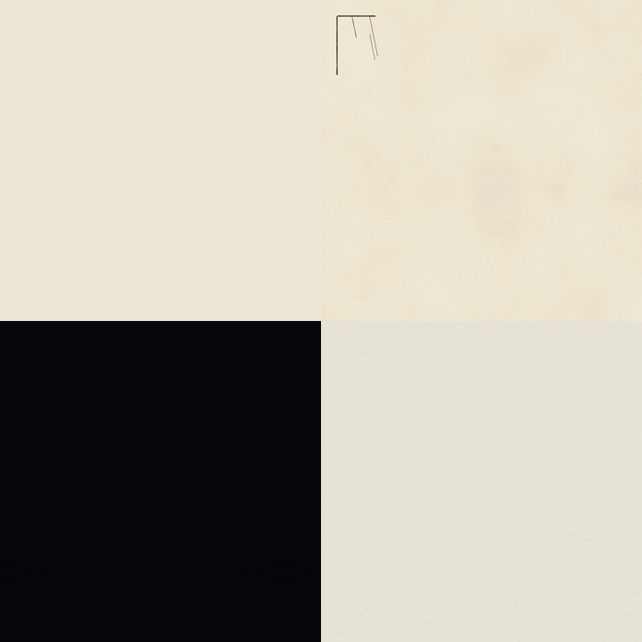
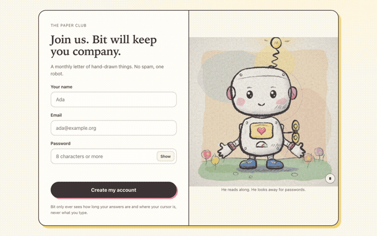
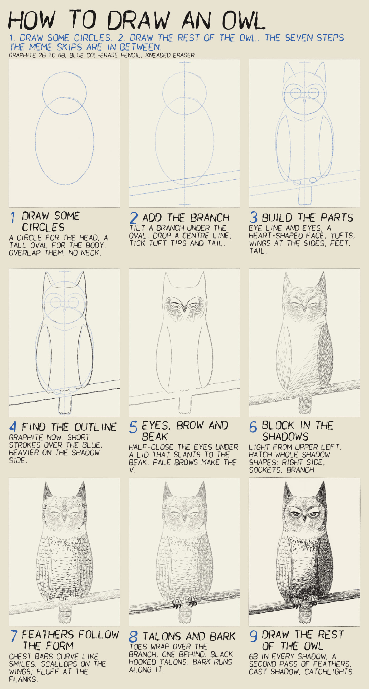

<p align="center">
  
</p>

<h1 align="center">anidoodle</h1>

<p align="center"><strong>코드로 쓰는 손그림.</strong></p>

<p align="center">
  31가지 스타일로 만드는 일러스트, 그림 타임랩스, 영화, 설명 영상, 인터랙티브 웹 아트.<br>
  모든 선은 함수이고 모든 음표는 연산이라, 같은 소스가<br>
  어떤 기기에서도, 어떤 크기로도, 언제까지나 같은 그림을 다시 그려내요.
</p>

<p align="center">
  <a href="https://github.com/alexgreensh/anidoodle/releases"></a>
  <a href="LICENSE"></a>
  
  
</p>

<p align="center"><a href="README.md">English</a> · <a href="README.ja-JP.md">日本語</a> · <a href="README.zh-CN.md">简体中文</a> · <b>한국어</b> · <a href="README.fr-FR.md">Français</a> · <a href="README.es-ES.md">Español</a></p>

<p align="center">
  <a href="#고를-수-있는-31가지-스타일">스타일</a> ·
  <a href="#모든-스타일은-스스로-그려져요">그려지는 영상</a> ·
  <a href="#코드로-작곡한-음악">음악</a> ·
  <a href="#만들-수-있는-것">만들 수 있는 것</a> ·
  <a href="#담겨-있는-것">담겨 있는 것</a> ·
  <a href="#먼저-그려지고-그다음-움직여요">움직임</a> ·
  <a href="#시작하기">시작하기</a>
</p>

## 고를 수 있는 31가지 스타일

<p align="center">
  
</p>

스타일마다 선을 긋는 방식이 달라요: 펜촉이 가늘어지는 모양, 물감이 번지는 자국, 분필이 슬레이트 위에서 스치는 질감, 색종이를 찢어낸 가장자리, 리소그래프 드럼의 망점, 그리고 한 줄의 새김선이 소용돌이치며 달이 되는 과정까지. 같은 소재도 손이 다르면 모양이 달라지는데, 마치 31명의 일러스트레이터가 각자 그린 것처럼요. 스타일마다 그 매체를 다루는 화가의 작업 순서대로, 그림이 한 획씩 완성되는 영상도 함께 들어 있어요. 브랜드에 맞는 스타일을 하나 고르면, 그 뒤로 나오는 모든 그림이 같은 손끝에서 나온 듯 일관돼요. 위의 모든 플레이트와 콘택트 시트 자체도 이 저장소 안의 코드로 그린 거예요.

<details>
<summary><b>31가지 스타일 모두</b>, 각각의 그리는 법</summary>

| 스타일 | 그리는 법 |
|---|---|
| **볼펜** | 볼펜 한 자루로, 교차해 쌓은 선에서 명암이 나와요 |
| **분할 색채** | 섞지 않은 색을 따로따로 찍는 인상주의식 표현 |
| **칠판 분필** | 분필 옆면을 문질러 가루까지 남겨요 |
| **지우는 목탄화** | 목탄으로 그리고 지우고 다시 그려, 지난 흔적을 남겨요 |
| **색연필** | 결이 있는 크림색 종이에 방향을 맞춰 선을 쌓아요 |
| **크레용** | 종이의 골짜기를 비워 두는 밀랍 낙서 |
| **오려 붙인 종이** | 찢고 자른 종이만 쓰고, 선은 그리지 않아요 |
| **시아노타입 청사진** | 청사진 종이에 제도펜으로 도면을 그려요 |
| **자수** | 수틀에 끼운 리넨에 실을 한 땀씩 놓아요 |
| **플랫 벡터** | 입자감과 긴 그림자를 더한 또렷한 기하학적 모양 |
| **민담 그림책** | 채색한 전경이 크림색 종이의 연필 선으로 스며들어요 |
| **잉크와 옅은 채색** | 먼저 옅은 색을 칠하고, 탄력 있는 펜촉으로 선을 그어요 |
| **아이소메트릭** | 평면에 명암을 넣은 2:1 등각 단면도 |
| **로우폴리 3D** | 코드로 그린, 면마다 색을 달리한 삼각형 |
| **마커 만화** | 평평한 색 채움과 굵은 윤곽선 하나 |
| **미드센추리 구아슈** | 불투명하고 무광인 형태, 마른 붓 가장자리와 자유로운 선 |
| **신문 망점** | 신문지에 검은 망점 한 판과 별색 한 가지를 찍어요 |
| **유화** | 바탕색을 칠한 캔버스에 거친 붓자국과 두꺼운 물감 |
| **페이퍼크래프트** | 겹겹이 자른 종이와 색칠한 조각을 두 프레임씩 보여줘요 |
| **연필과 수채화** | 연필 선을 끝까지 채우지 않는 수채화 번짐 |
| **픽셀 아트** | 저해상도 격자에 고정된 16색 팔레트 |
| **리소그래프** | 위치가 조금씩 어긋나며 겹쳐 찍히는 잉크 드럼 |
| **고무호스 애니메이션** | 휘어지는 팔다리와 필름 입자가 있는 1930년대 잉크 만화 |
| **스크래치보드** | 검은 점토층을 긁어 하얀 선을 드러내요 |
| **한 줄 판화** | 끊어지지 않는 나선 한 줄의 굵기로 명암을 만들어요 |
| **점묘** | 펜으로 찍은 점의 밀도로 명암을 표현해요 |
| **그림책** | 캐릭터를 연필과 수채화로 그려요 |
| **수묵화** | 먹을 머금은 붓 하나로 흡수성 종이에 그려요 |
| **장난감 블록** | 돌기가 있는 플라스틱 블록을 한 층씩 쌓아요 |
| **빈티지 스크랩북** | 낡은 종이에 판화, 오린 글자 제목, 테이프로 붙인 카드 |
| **목판화 / 우키요에** | 와시에 새긴 주판과 색판을 차례로 찍어요 |

</details>

## 모든 스타일은 스스로 그려져요

<p align="center">
  
</p>

각 스타일은 하나의 소스에서 완성된 그림과 그리는 과정을 담은 영상을 함께 내놓아요. 그 매체를 쓰는 화가의 순서를 그대로 따라가죠. 수채화는 연필로 밑그림을 그리고 밝은색부터 어두운색까지 물감을 놓아요. 목판화는 주판을 먼저 찍고 색판을 하나씩 더해요. 픽셀 아트는 단색 형태를 먼저 잡고 픽셀 묶음에 명암을 넣어요. 페이드인은 없어요. 획은 하나씩 자라고, 물감은 붓이 닿은 자리에서 퍼져요. 영상의 마지막 프레임은 정지 이미지와 픽셀 하나까지 같아요. 타임랩스이자 제작 과정이자 설명 그림인 셈이에요.

## 코드로 작곡한 음악

샘플도 녹음도 쓰지 않아요. 음표는 데이터로 적고, 모든 소리를 합성해요. 현이 울리며 만드는 맥놀이, 세게 칠수록 밝아지는 해머, 오래 울리는 페달까지 구현한 피아노에 마림바, 하프, 기타, 첼레스타, 종, 현악기, 칩튠, 드럼이 있어요. 모든 장조와 단조, 구간마다 다른 분위기, 어떤 길이에도 맞춰지는 주제 선율까지요.

| 들어보기 | |
|---|---|
| [내림가장조 녹턴](assets/audio/nocturne-45s.mp3) | 45초 피아노곡. 쌓이고, 절정에 이른 뒤, 조용히 가라앉아요 |
| [표현을 담아 연주한 피아노](assets/audio/piano-8s.mp3) · [같은 음을 평평하게 연주한 피아노](assets/audio/piano-flat-baseline-8s.mp3) | 차이는 연주에 있어요. 성부 배치, 프레이징, 페달이 달라요 |
| [영화 음악·경외감](assets/audio/sampler-cinematic-awe-8s.mp3) · [로파이](assets/audio/sampler-lofi-nostalgic-8s.mp3) · [마림바](assets/audio/sampler-marimba-curious-8s.mp3) · [일렉트로닉](assets/audio/sampler-drive-electronic-8s.mp3) | 더 많은 분위기와 악기 |
| [15초로 맞춘 녹턴 주제](assets/audio/fit-theme-15s.mp3) | 작곡기가 길이에 맞는 형식을 골라요 |

## 나를 알아채는 웹페이지

<p align="center">
  
</p>

실제 사이트에 넣을 수 있는 인터랙티브 일러스트예요. 커서를 따라가고 버튼에 반응하는 마스코트, 스크롤할 때 스스로 그려지는 히어로 이미지, 비밀번호 칸에서 눈을 가리는 폼 친구까지요. 작은 ES 모듈 하나와 `<ani-doodle>` 요소 하나면 되고 프레임워크는 필요 없어요. 동작 줄이기 설정과 키보드 조작도 지원해요. 각 프레임은 그때까지의 입력이 정해주는 결과예요.

## 내 이미지를 가져오기

- **스타일 맞추기.** 좋아하는 그림을 보여주면 선, 가장자리, 색, 종이의 느낌을 살펴보고 같은 화풍으로 새로운 그림을 그려요. 그림 자체가 아니라 스타일만 빌려요.
- **사진 다시 그리기.** 사진을 스크래치보드, 목판화, 한 줄 판화로 바꿔요. 명암과 털이나 천의 방향을 측정하고 보이는 모든 획을 코드로 그려요.
- **캐릭터 유지하기.** 캐릭터를 한 번 만들면 장면과 포즈, 목판화에서 장난감 블록까지 스타일이 바뀌어도 같은 모습으로 남아요.

## 그림 그리는 법 배우기

<p align="center">
  
</p>

무언가 그리는 법을 묻거나 직접 그린 그림을 가져오면, anidoodle이 수업으로 다시 구성해요. 단계별 시트와 자막이 달린 타임랩스에 각 단계에서 볼 것, 그리는 법, 흔한 실수를 담아요.

## 만들 수 있는 것

| 용도 | 받게 되는 것 |
|---|---|
| **웹사이트** | 히어로 일러스트, 기능마다 들어갈 스팟 아트, 빈 상태 화면과 404 페이지까지 전부 한 손에서 나온 그림으로. 하나의 소스에서 어떤 크기로든 투명 배경 PNG를 뽑아내니, 레티나 디스플레이와 인쇄용 해상도가 그냥 따라와요. |
| **설명 자료와 보고서** | 작동 원리를 보여주는 다이어그램, 단면도, 애니메이션 인포그래픽에 손글씨 느낌의 라벨까지. 진지한 내용에는 칠판, 청사진, 볼펜 스타일이 잘 어울려요. |
| **브랜드** | 스스로 그려지는 로고, 타이틀 시퀀스, 게시물마다 브랜드를 지켜주는 소셜 카드 템플릿. |
| **소셜과 채팅** | 끊임없이 반복되는 루프, GIF, 투명 배경 애니메이션 스티커까지, 피드에 맞는 크기로. |
| **덱과 문서** | 하나의 프로그램에서 나온 한 세트의 섹션 일러스트. 시드값만 바꾸면 같은 스타일의 자매 이미지가 나와요. |
| **스토리** | 스토리보드와 애니매틱이 오리지널 스코어를 갖춘, 길이에 제한 없는 완성된 영화로 자라나요. |
| **내 이미지** | 그림을 가져오면 그 스타일로 새로운 소재를 그려요. 사진을 가져오면 31가지 화풍 중 하나로 다시 만들고, 모든 획을 코드로 그려요. |
| **웹페이지** | 커서를 따라 움직이고 클릭과 폼에 반응하며, 페이지를 스크롤하면 스스로 그려지는 인터랙티브 일러스트. |
| **학습** | 그림이 만들어지는 과정을 알려주는 단계별 시트와 타임랩스. 어디를 살펴봐야 하는지, 흔한 실수는 무엇인지도 배워요. |
| **캐릭터** | 한 번 만든 캐릭터를 장면과 포즈, 스타일이 달라져도 똑같이 유지해요. |

그냥 평범한 말로 요청하면 돼요. *“채용 페이지에 쓸 리소그래프 등대 이미지, 1600×900 사이즈로”* 또는 *“요금제 단계를 한눈에 보여주는 칠판 스타일 설명 그림”* 같은 식으로요. anidoodle이 알아서 적절한 워크플로와 스타일 레시피로 연결해주고, 요청에서 빠진 부분만 되물어요.

## 담겨 있는 것

엔진은 쉬운 절반이에요. 진짜 어려운 건 손끝의 감각인데, anidoodle이 그걸 대신 짊어져요. 여섯 가지 교훈인데, 하나하나가 먼저 실패해보고 얻어낸 뒤 기록으로 남긴 거라, 지난 프로젝트가 끝난 지점에서 바로 시작할 수 있어요:

- **스토리**는 모든 작품에 의미를 줘요. 스틸컷 하나에는 아이디어 하나와 초점이 되는 소재 하나, 영화에는 하나의 변화와 하나의 결말, 그리고 되돌아오는 상징 하나. → [`storytelling.md`](skills/anidoodle/references/storytelling.md)
- **사실감**은 이름을 붙이는 데서 나와요. 해부 구조, 시점, 그리고 펼쳐본 레퍼런스까지 정확히 짚어야, 나비 한 마리도 몸과 날개맥을 가진 생명체로 읽혀요. → [`realism-and-craft.md`](skills/anidoodle/references/realism-and-craft.md)
- **스타일**은 선 하나하나에 깃들어요. 31가지 완전한 레시피, 작업에 맞게 하나를 고르는 가이드, 그리고 나만의 스타일을 만드는 방법까지. → [`styles.md`](skills/anidoodle/references/styles.md)
- **음악**은 음표로 작곡하고 코드로 합성해요. 모델링한 피아노와 십여 가지 악기, 모든 장조와 단조, 구간별 분위기, 어떤 길이에도 맞는 테마까지 갖췄어요. → [`music/README.md`](skills/anidoodle/references/music/README.md)
- **결정론**은 우리의 보증이에요. 순수 함수와 시드값 기반 난수를 쓰니까, 소스만 있으면 누구든 완전히 똑같은 작품을 다시 만들어낼 수 있어요. → [`determinism-and-contract.md`](skills/anidoodle/references/determinism-and-contract.md)
- **작업 방식**이 속도를 지켜줘요. 스틸컷 하나로 룩을 먼저 검증하고, 그다음은 막힘없이 쭉 밀고 나가고, 틀렸을 때 비용이 큰 지점에서만 승인을 받는 식으로요. → [`working-method.md`](skills/anidoodle/references/working-method.md)

모든 포맷이 같은 소스에서 나와요: PNG, 스코어가 포함된 MP4, GIF, 투명 배경을 지원하는 WebM과 애니메이션 PNG, 그리고 그 자체로 완결된 HTML 파일 하나까지. → [`formats.md`](skills/anidoodle/references/formats.md)

## 먼저 그려지고, 그다음 움직여요

<table>
  <tr>
    <td width="50%" align="center"></td>
    <td width="50%" align="center"></td>
  </tr>
  <tr>
    <td align="center"><sub>선은 사람 손이 그리는 순서 그대로 <strong>만들어져요</strong>.</sub></td>
    <td align="center"><sub>청사진이 수채화 속에서 눈을 뜨고 자신의 풀밭으로 날아가요.</sub></td>
  </tr>
</table>

**▶ 47초 분량의 전체 영화**, 소리를 켜고 보세요. 1080×1080 해상도에 오리지널 스코어까지, 모든 프레임과 샘플을 코드로 생성했어요:

https://github.com/user-attachments/assets/019d46d3-536a-4843-9f68-8e8f5f5c3401

순수 함수 하나가 프레임 하나하나를 그려요. 완성된 일러스트는 그 함수를 한 번 호출한 결과이고, 스티커는 같은 함수를 반복 호출한 결과이고, 영화는 거기에 스토리와 스코어를 입힌 결과예요. 셋 다 똑같은 보증이 적용돼요.

## 값은 한 번, 그림은 영원히

이미지 생성 모델은 렌더링할 때마다, 프레임 하나하나마다 토큰과 연산을 써요. 그리고 매번 다른 그림을 그리죠. 코드는 딱 한 번만 써요. 47초짜리 영화는 프로그램 하나예요: 한 번 작성해두면, 1,410개 프레임과 풀 스테레오 스코어 전체를 어떤 크기로든, 어떤 기기에서든, 실행할 때마다 공짜로 렌더링해요. 첫 실행에서 프레임당 코드 토큰 약 60개가 드는 셈이고, 그다음부터는 0이에요. 스틸컷 하나는 몇백 줄이면 되고, 이미지 한 세트 전체는 시드값 목록 하나면 돼요.

## 시작하기

**Claude Code:**

```bash
/plugin marketplace add alexgreensh/anidoodle
/plugin install anidoodle@alexgreensh-anidoodle
```

**Codex:**

```bash
codex plugin marketplace add alexgreensh/anidoodle
```

그다음 Codex TUI에서 `/plugins`를 열어 anidoodle을 설치하세요.

**다른 에이전트:** anidoodle은 표준 스킬 폴더(`skills/anidoodle/SKILL.md`)이므로 스킬을 읽는 환경이라면 어디든 복사해서 쓸 수 있어요.

그다음엔 원하는 걸 말하면 돼요: *“레시피 페이지에 쓸 연필과 수채화 스타일의 배 그림 그려줘”*. 엔진을 직접 다뤄보고 싶다면:

```bash
node <anidoodle>/engine/tools/scaffold.mjs ~/art --still hero --film intro --format 9x16 --duration 60
cd ~/art && npm install && npx playwright-core install chromium

node tools/still.mjs  hero  --out out/hero.png --scale 2   # a finished illustration, print size
node tools/render.mjs intro --out out/intro.gif            # a loop; also .mp4 with score, .webm with alpha
node tools/emit.mjs   intro --out out/intro.html           # the whole piece as one offline file
node tools/gate.mjs   hero                                 # determinism, contract and dead air in one pass
```

Node 20 이상이 필요해요. 스틸컷은 위에서 설치한 브라우저만 있으면 되고, 움직이는 건 전부 `ffmpeg`도 함께 써요.

`emit`은 약 100KB짜리 HTML 파일 하나를 만들어요. 더블클릭하면 오프라인 상태에서도 소리와 함께 재생돼요. 레시피 자체를 담고 있어서, 열 때마다 처음부터 다시 전부 그려내요. 이메일에 첨부하는 순간, 작업실 하나를 통째로 보낸 셈이에요.

네 개의 백엔드가 하나의 아트 코어를 공유해요. 코어는 지금 누가 그리고 있는지 모르는 채로 태평하죠: `playwright`, `html-player`, `remotion`, `hyperframes`.

## 예제 영화

`skills/anidoodle/example/` 폴더에는 **Mechanical Lepidoptera**가 들어있어요: 1,410개 프레임, 47초 분량으로, 스스로 설계도를 그리다가 수채화 속에서 살아나고, 풀밭에 자신의 청사진을 남기고 떠나는 태엽 나비 이야기예요. 엔진 전체가 이 한 작품 안에 담겨 있어요. 실제 해부 구조 위에 손으로 찍은 제어점, 픽셀 하나가 무엇에 의존하는지 전부 이름 붙인 캐시 키, 레시피로 만든 스코어, 그리고 설계도에서 생명으로 끊김 없이 이어지는 움직임까지요. 스타일 플레이트는 `skills/anidoodle/engine/src/canvas-core/` 안에 엔진과 나란히 놓여 있고, 각각 맨 위에 레시피가 적혀 있어요. 아무거나 열어서 숫자 하나만 바꿔보면, 뭐가 움직이는지 바로 보여요.

## 설계부터 정직하게

소리와 움직임은 증거로 말해요. 스코어나 움직임에 대한 모든 문장 뒤에는 실제 측정값이나 사람의 눈으로 확인한 근거가 있고, 초록색 체크 표시는 다시 실행해서 검증된 뒤에야 인정돼요. 이런 원칙 덕분에 같은 작품이 어떤 기기에서도, 매번, 바이트 단위까지 똑같이 나와요.

---

[Apache License 2.0](LICENSE) 라이선스를 따라요. Copyright 2026 Alex Greenshpun.

<sub>anidoodle로 만들었어요. 나비를 몇 번 정직하게 그려보면서 아는 걸 전부 배웠거든요.</sub>
