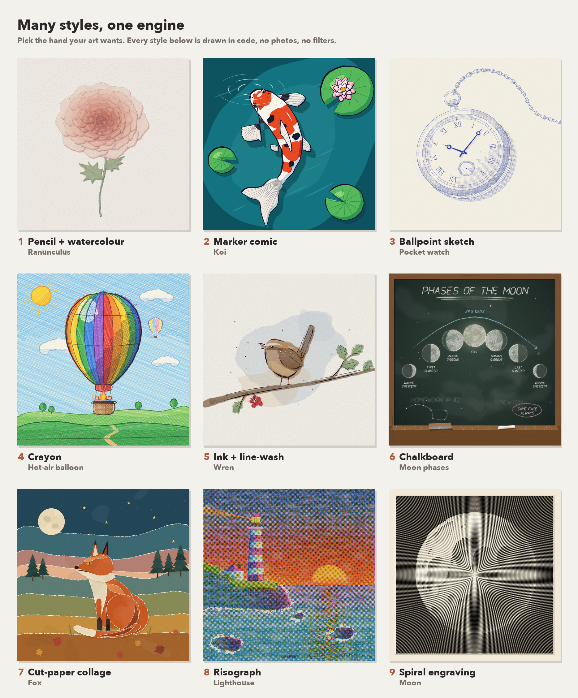

<p align="center">
  <br>
</p>

# anidoodle

**A film, drawn entirely in code. Every pixel is painted by a function, every note is synthesized, and the same seed draws the same picture forever.**

<p align="center">
  <br>
  <em>This clockwork butterfly was written, not filmed. It drafts itself as a blueprint, wakes in watercolour, and flies off leaving the plate in the grass.</em>
</p>

<p align="center"><strong>▶ <a href="assets/mechanical-lepidoptera.mp4">Watch the full 47-second film</a></strong> · 1080&times;1080, with an original score, every frame and sample generated in code</p>

## The idea

anidoodle hands you the source of a picture: a small program that draws it. Change a seed and you get a sister image. Nudge a number and the wing lifts higher. Commit it and your art lives in git, beside your code, rebuilding identically on any machine, at any size, this year and next.

One pure function paints each frame. A single call is a finished illustration. A run of them is a film. The same guarantees hold for both.

## What it packs

The engine is the easy half. The craft is the part anidoodle carries for you, five lessons, each one earned by getting a film wrong first and written down so you start where the last project ended:

- **Story** decides everything. One transformation, one payoff, one visual token that returns, so a film has a spine and the medium shifts only when the story changes state. → [`references/storytelling.md`](references/storytelling.md)
- **Realism** comes from naming it. The anatomy, the view, and the reference you opened, so a butterfly reads as a creature with a body and veins. → [`references/realism-and-craft.md`](references/realism-and-craft.md)
- **Music** follows a recipe. Major key, plucked, a phrase that asks a question and resolves home, warm and sure. → [`references/music-recipe.md`](references/music-recipe.md)
- **Determinism** is the guarantee. Pure functions and a seeded random, so anyone who has the source rebuilds the exact same film, forever. → [`references/determinism-and-contract.md`](references/determinism-and-contract.md)
- **Method** keeps you fast. Prove the look on one still, then build straight through to the end, and spend approval where being wrong is expensive. → [`references/working-method.md`](references/working-method.md)

## It draws stills too

A single call is a complete illustration. Render your landing-page hero at full size, a thumbnail, and a social card from the one source, on brand, at any resolution you ask for.

<p align="center">
  <br>
  <em>The marks are <strong>made</strong>, in the order a hand would make them.</em>
</p>

**Reach for it when you want:** website and product art, hero images and empty states that stay on brand at every size; editorial diagrams and cutaways that move to show how a thing works; title sequences, animated logos, and brand stories that render the same in every pipeline; storyboards and animatics, sketched fast and grown into the finished film; and generative series, where one program yields a whole family of images from different seeds.

## Many styles, one engine

<p align="center">
  <br>
  <em>Eight subjects, eight hands. Pick the style your art wants, and the engine draws it.</em>
</p>

Every style is its own way of making a mark: the taper of a nib, the bleed of a wash, the scumble of chalk on slate, the torn edge of cut paper, the halftone of a risograph drum. One engine drives them all, so eight looks read as eight different artists, and reaching a ninth is a page of code.

## Pay once, draw forever

A picture model spends tokens and compute on every frame of every render, and it never draws the same thing twice. Code spends them once. The 47-second film is a single program: written one time, it renders all 1,410 frames and a full stereo score, at any size, on any machine, free every time it runs. That is about sixty tokens of code per frame on the first pass, and zero on every pass after. A single still is a few hundred lines. A whole family of images is just new seeds.

## Try it

```bash
node engine/tools/scaffold.mjs ~/my-film --film myFilm   # a new project with a starter film
cd ~/my-film && npm install

node tools/still.mjs myFilm --out out/look.png     # a single finished illustration
node tools/emit.mjs  myFilm --out out/my-film.html # a self-contained player, one file
node tools/gate.mjs  myFilm --mp4 out/my-film.mp4  # determinism, contract and dead-air in one pass
node tools/render.mjs myFilm                        # the MP4
```

`emit` writes one HTML file, around 100 KB, that plays the whole film with sound on a double-click, offline. It carries the recipe and draws the whole thing again from scratch every time you open it. Attach it to an email and you have shipped a studio.

Four backends share one art core, and the core stays blissfully unaware of which is drawing it: `playwright`, `html-player`, `remotion`, `hyperframes`.

## The example film

`example/` holds **Mechanical Lepidoptera**: 1,410 frames, 47 seconds, a clockwork butterfly that drafts itself, comes alive in watercolour, and leaves its blueprint in the grass. It is the whole engine in one piece: control points placed by hand over real anatomy, a cache key that names every input a pixel depends on, a score built from the recipe, and one unbroken move from built to alive. Open it, change a number, and watch what moves.

## Honest by design

Sound and motion earn their claims. Every statement about the score or the movement carries a measurement or a human's eye behind it, and a green checkmark counts once it has been re-run. That discipline is why the same film comes back byte for byte, every time, on every machine.

---

Licensed under the [Apache License 2.0](LICENSE). Copyright 2026 Alex Greenshpun.

<sub>Built with anidoodle, which learned everything it knows by drawing the butterfly a few honest times.</sub>
